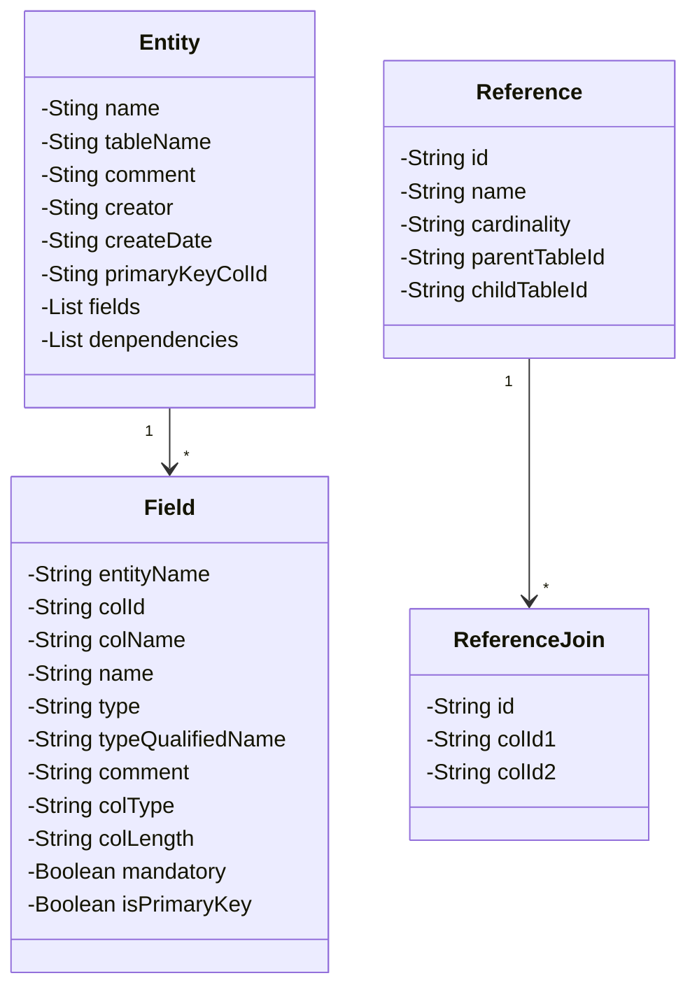

# JPA实体生成
为了~~偷懒~~节省时间

## 构思

1. 使用 Power Designer 设计表结构，保存为 pdm 格式
2. 通过 `xml` 解析技术解析 `pdm`文件，自动生成`JPA`实体类
    1. `xml` 解析库可以用dom4j、jaxen（支持XPATH）
    2. `pdm` 文件可以直接转成 `xml`文件，直接修改文件后缀名即可
    3. 代码生成：Apache Freemarker 模板引擎
        1. 可以用于生成Java源代码文件
3. 将源代码文件生成到指定的包下

## 开发环境

- Java 8
- IntelliJ IDEA 2023.1.1
- Maven 3.6.3

## 技术选型

| 名称 | 版本 | 说明 | 官网/仓库 |
| --- | --- | --- | --- |
| PowerDesigner | 16.5 | 数据库建模 | https://www.sap.com/ |
| Lombok | 1.18.24 | 简化实体类开发 | https://projectlombok.org/ |
| Dom4j | 2.1.4 | XML解析库 | https://dom4j.github.io/ |
| Jaxen | 2.0.0 | XPATH引擎 | https://github.com/jaxen-xpath/jaxen |
| Apache Freemarker | 2.3.32 | 模板引擎 | https://freemarker.apache.org/ |
| Apache Commons Lang3 | 3.12.0 | 基础工具库 | https://commons.apache.org/proper/commons-lang/ |
| Apache Commons Collections4 | 4.4 | 集合工具库 | https://commons.apache.org/proper/commons-collections/ |
| Apache Commons Text | 1.10.0 | 文本工具库 | https://commons.apache.org/proper/commons-text/ |
| Apache Commons Logging | 1.2 | 日志门面 | https://commons.apache.org/proper/commons-logging/ |
| Logback | 1.2.10 | 日志实现 | https://logback.qos.ch/ |
| JavaxAnnotationAPI | 1.3.2 | 扩展注解包 | https://mvnrepository.com/artifact/javax.annotation/javax.annotation-api |
| Hibernate | 5.3.20.Final | ORM框架 | https://hibernate.org/ |
| Junit | 4.13.2 | 单元测试 | https://junit.org/ |

## 类图




# PDM文档解析映射

## 表

| 名称         | 映射字段   | 说明     |
| ------------ | ---------- | -------- |
| Code         | tableName  | 表名称   |
| Creator      | creator    | 创建人   |
| CreationDate | createDate | 创建日期 |
| Comment      | comment    | 注释     |

## 列

| 名称      | 映射字段  | 说明                       |
| --------- | --------- | -------------------------- |
| ID        | colId     | PDM 文档列标签的 ID 属性值 |
| Code      | colName   | 列名称                     |
| Comment   | comment   | 注释                       |
| DataType  | colType   | 列数据类型                 |
| Length    | length    | 列数据类型的长度           |
| Mandatory | mandatory | 该列是否必填               |

# 配置项

```java
package org.shiloh.config;

import lombok.experimental.UtilityClass;

/**
 * 实体生成器配置
 *
 * @author shiloh
 * @date 2023/8/3 15:50
 */
@UtilityClass
public class EntityGeneratorConfig {
    /**
     * 实体模板存放路径
     */
    public static final String TEMPLATE_PATH = "src/main/resources/templates";

    /**
     * 实体模板文件名
     */
    public static final String TEMPLATE_NAME = "entity.ftl";

    /**
     * 源码存放路径
     */
    public static final String SOURCE_CODE_PATH = "src/main/java/";

    /**
     * 实体类包名
     */
    public static final String ENTITY_PACKAGE_NAME = "org.shiloh.entity";

    /**
     * 表名称统一前缀，为空则不生效
     */
    public static final String TABLE_NAME_PREFIX = "t_";
}
```

# 用法

1. 复制一份设计好的PDM文件，将后缀名修改为 `xml` 
2. 将 `xml` 文件放到项目的`src/main/resources`目录下
3. 调整配置（如需要）
4. 运行测试用例 `src/test/org/shiloh/test/EntityGenerateTests.java` ，查看控制台日志~

```java
package org.shiloh.test;

import org.junit.Test;
import org.shiloh.generator.EntityGenerator;
import org.shiloh.parser.PdmParser;

import java.net.URL;

/**
 * 实体生成测试
 *
 * @author shiloh
 * @date 2023/8/3 10:46
 */
public class EntityGenerateTests {
    /**
     * PDM 文件名
     */
    private static final String PDM_FILE_NAME = "test2.xml";

    /**
     * 测试实体生成
     *
     * @author shiloh
     * @date 2023/8/3 11:49
     */
    @Test
    public void testGenerateEntities() throws Exception {
        final URL url = EntityGenerateTests.class
                .getClassLoader()
                .getResource(PDM_FILE_NAME);
        EntityGenerator.generate(PdmParser.parse(url));
    }
}

```

# 生成结果示例

```java
package org.shiloh.entity;

import java.io.Serializable;
import javax.persistence.*;
import lombok.Setter;
import lombok.Getter;
import lombok.ToString;
import java.util.Date;

/**
 * 时段配置表
 *
 * @author shiloh
 * @date 2023/08/03 15:38
 */
@Entity
@Setter
@Getter
@ToString
@Table(name = "time_config")
@org.hibernate.annotations.Table(appliesTo = "attend_time", comment = "时段配置表")
public class AttendTime implements Serializable {
    private static final long serialVersionUID = 1L;

    /*
     * 主键
     */
    @Id
    @GeneratedValue(strategy = GenerationType.IDENTITY)
    @Column(name = "id", columnDefinition = "bigint(20) not null comment '主键'")
    private Long id;

    /*
     * 时段名称
     */
    @Column(name = "name", columnDefinition = "varchar(100)  comment '时段名称'")
    private String name;

    /*
     * 时段类型
     */
    @Column(name = "type", columnDefinition = "varchar(20)  comment '时段类型'")
    private String type;

    /*
     * 开始时间
     */
    @Column(name = "start_time", columnDefinition = "time  comment '开始时间'")
    private Date startTime;

    /*
     * 结束时间
     */
    @Column(name = "end_time", columnDefinition = "time  comment '结束时间'")
    private Date endTime;
}
```


# 后续计划

- [ ] 支持生成外键关联
- [ ] 支持自定义配置
- [ ] 支持通过数据库表结构生成实体

:-)

# 许可证

[MIT](./LICENSE)
